## GPT2
- 参考链接：https://jalammar.github.io/illustrated-gpt2/
- 视频参考：https://www.bilibili.com/video/BV1pZ421B77B/?spm_id_from=333.337.search-card.all.click&vd_source=3f001f678b16d4dba0cdf04e0ee9b395
- nanoGPT：https://www.bilibili.com/video/BV1nT411a7gS/?spm_id_from=333.337.search-card.all.click&vd_source=3f001f678b16d4dba0cdf04e0ee9b395
  - https://www.bilibili.com/video/BV1CP41147Cw/?spm_id_from=333.337.search-card.all.click&vd_source=3f001f678b16d4dba0cdf04e0ee9b395

### 模糊知识点
- （1）注意力机制的原始论文中，encoder 和 decoder 之间的交叉注意力，是需要与每一层的 decoder 输出进行计算
  - 

### 架构差异 
- （1）bert采用的是12层的encoder架构， GPT2采用12层的decoder架构（最小的版本）， TransformerXL采用 循环decoder架构
  - 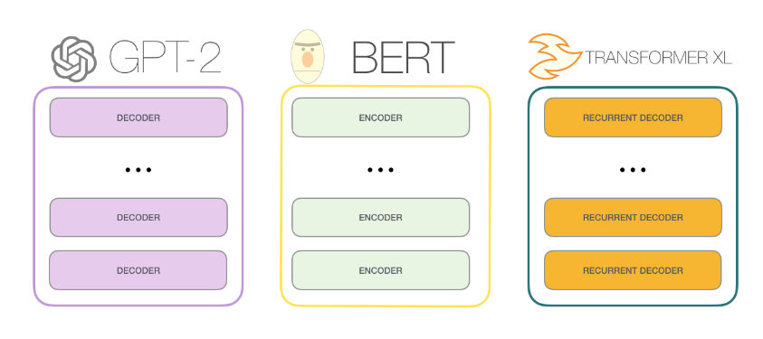
- （2）bert不是自回归的模型，能够使用上下文的信息（左下图）， GPT2是自回归的模型（右下图），只能使用上文以文字接龙的方式生成。Transformer也是自回归模型，使用循环decoder能够使用上下文信息
  - 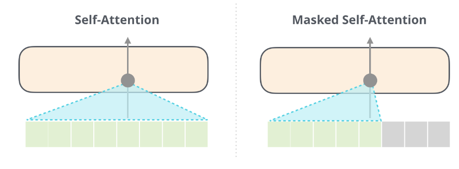

### 不同GPT2的参数量和大小
- （1）GPT2不同层数模型的参数量 
- 
- 

### 词嵌入 和 位置嵌入 处理 每个词
- （1）词汇表（词嵌入 WTE），是指一个语言，有多少种词汇拆分，
  - 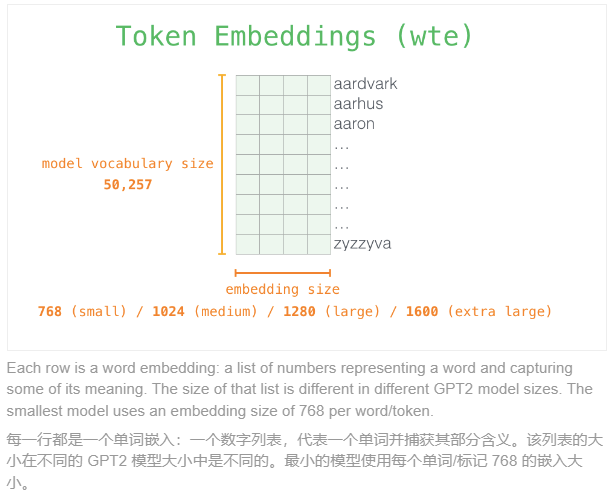
  - 如图，词汇表的每一个词，都是进行 loss梯度下降时的 label。
  - 词汇表的每一行，是一个数值，这个数值表示一个词的token embedding，
  - 将一句话送入GPT之前，需要先查每个词的 token 嵌入
    - 举例输入："I am a boy"， 先查 I 的token嵌入，再查 am 的token嵌入...
- （2）如上图，每一行，就是一个词的 embedding大小， 不同的GPT的 token embedding大小是不同的，最小的dim是 768
- （3）一句话中，其每个词都有一个唯一的位置，这个位置token.idx, 表示词的相对位置，在输入GPT之前，需要将位置信息嵌入（WPE）token
  - GPT2的位置嵌入的位置数目最长为 1024，也就是最长只能输入 1024个词，一个文本
  - GPT2的位置嵌入的dim维度，最小是 768，最大是 1600，也就是768dim表示一个位置信息（与token的长度 一一对应）
  - 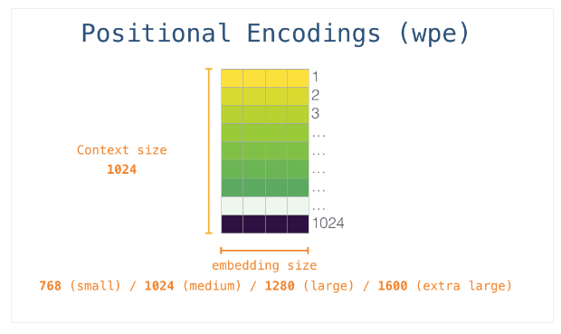
- （4）一个词，首先查词嵌入表WTE， 查到这个词的 token embedding，然后，查位置嵌入表WPE，查到这个词的位置嵌入。然后将这两个 嵌入相加，输入到 GPT
  - 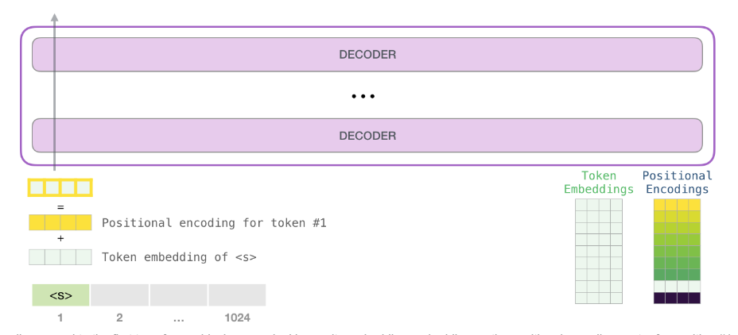
- （5）然后，这个 嵌入向量，就会在堆栈的 GPT的 编码器中，反复进行 交叉注意力计算
  - 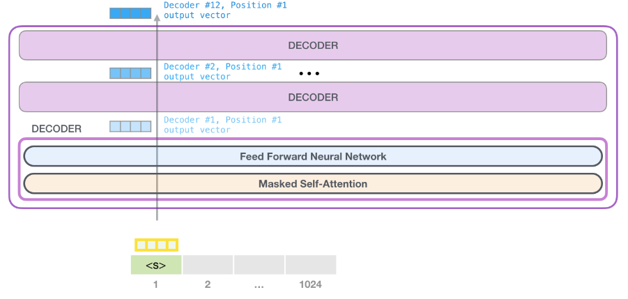

### QKV更容易理解的形式，文件夹的形式，直接参考原链接，使用豆包翻译
- https://jalammar.github.io/illustrated-gpt2/
- （1）每个位置，输入token长度为 768，输出token长度 也是 768，词汇表的 每一行长度也为768，最后乘法：得到就是词汇表每个词的 概率：
  - 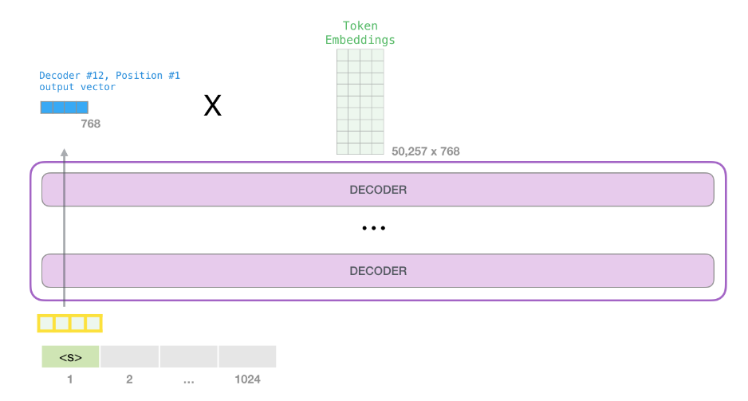
  - 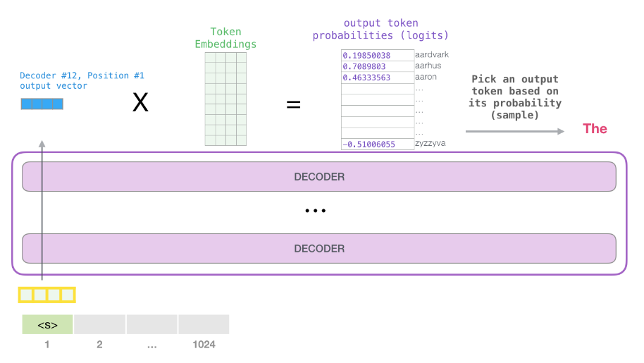
- （2）蒙版掩码，是先计算注意力分数，然后，在分数的矩阵上，mask，然后按比例重新计算分数
  - 如下图：robot只能看到自己，must能够看到自己和robot：
  - 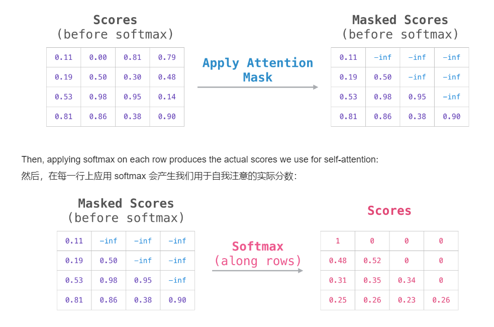
- （3）每个decoder，最后二层是 FC全连接层，包含 升维 和 降维。（这个地方，与最后一层，不要搞混，最后一层需要 求 **词汇表的 概率分布**）
- 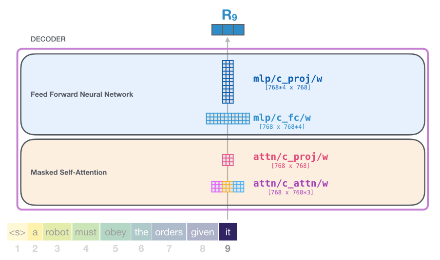
  - 升维：第一个FC层
    - 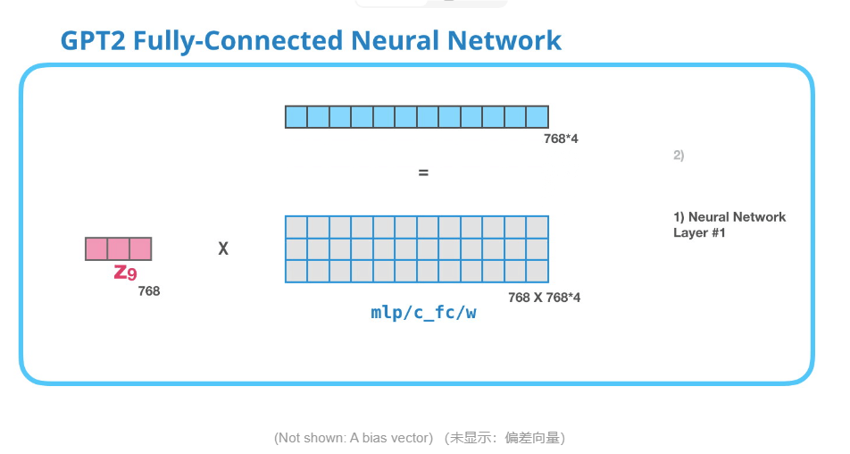
  - 降维：第二个FC层
    - 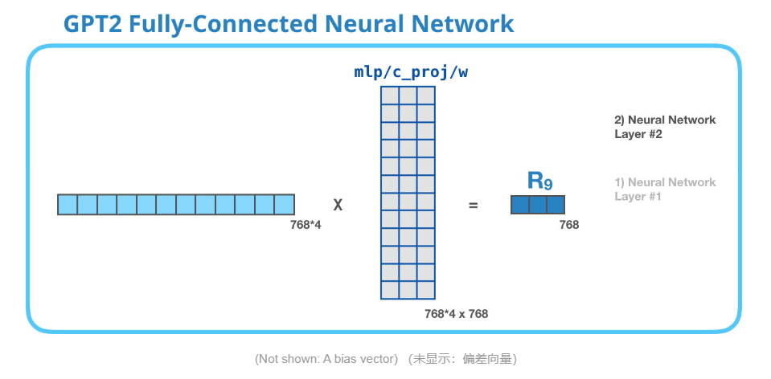
  